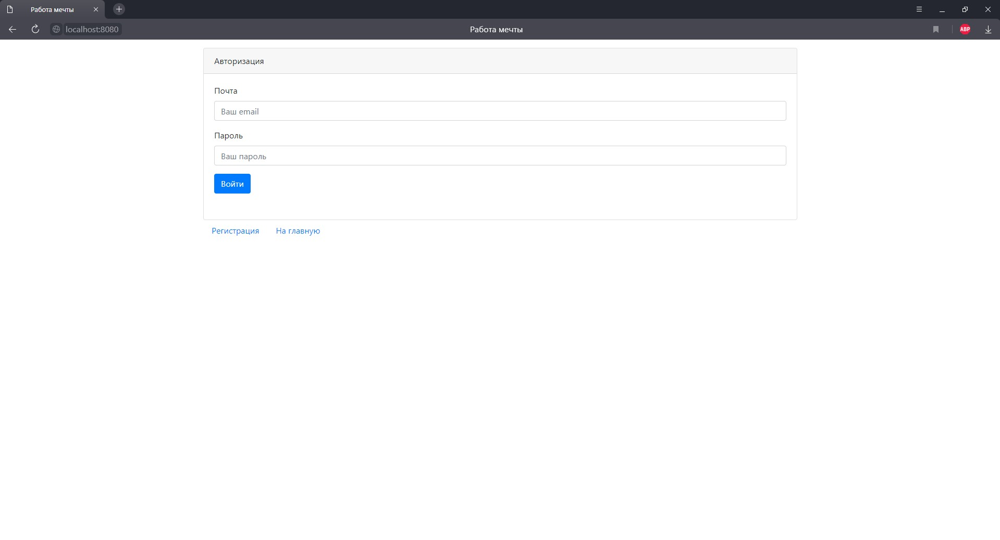
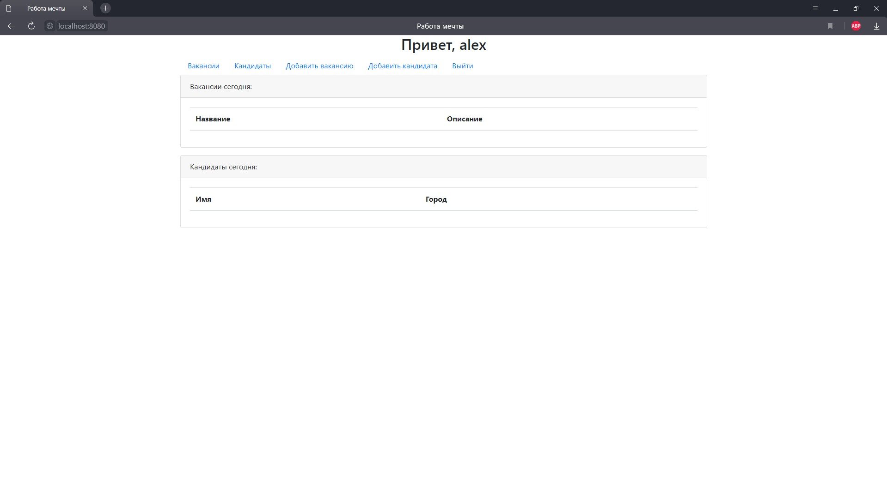
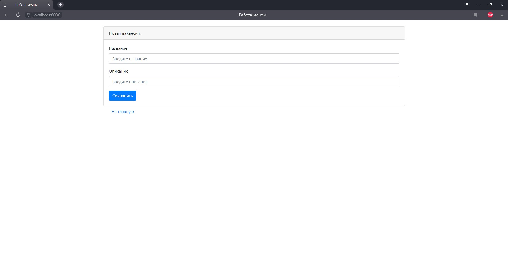
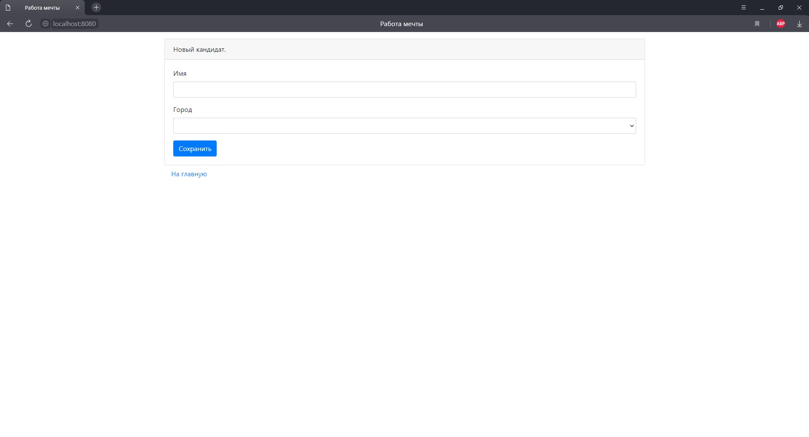
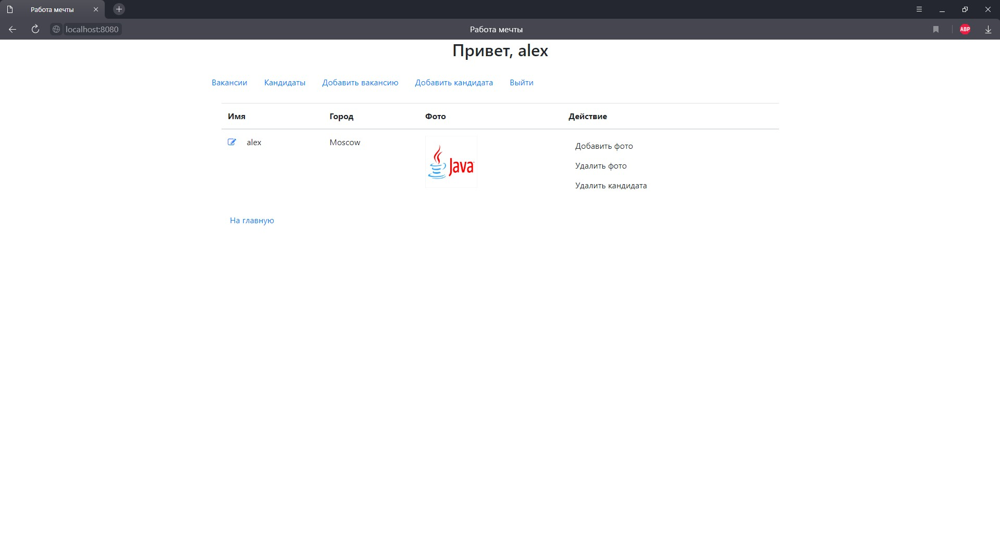
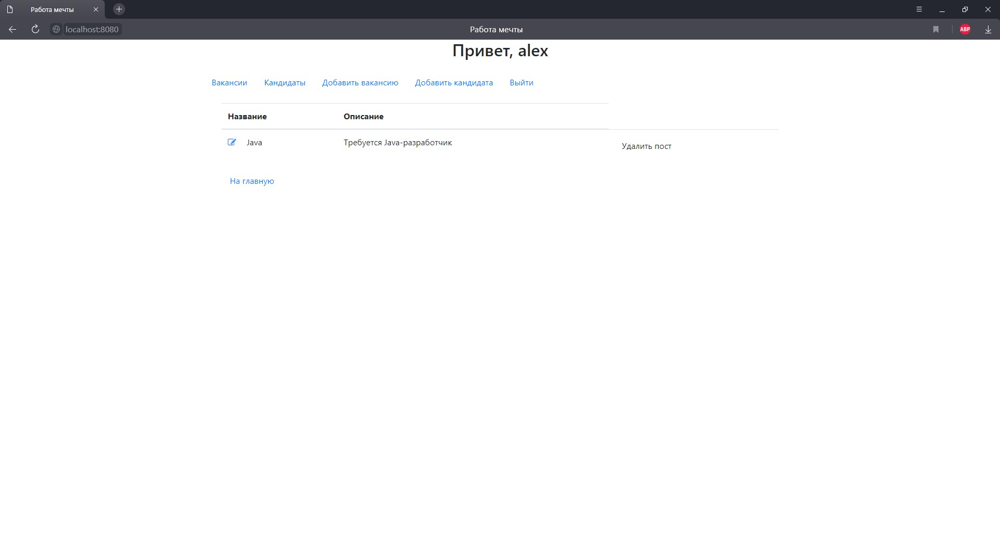

# job4j_dreamjob

Проект представляет из себя веб-приложение по поиску работы и размещению вакансий.
В нем можно добавлять, редактировать, удалять вакансии, добавлять, редактировать, удалять кандидатов, 
а так же размещать их фотографии.
На главной странице отображаются вакансии и кандидаты за последние сутки.
Так же присутствует регистрация и авторизация пользователя.
Технологии: 
-Java EE Servlet API
-Tomcat
-JDBC
-PostgreSQL
-JS (jQuery, AJAX)
-JSP
-JSTL 
-HTML
-Log4j
-Maven
-Codecov.

